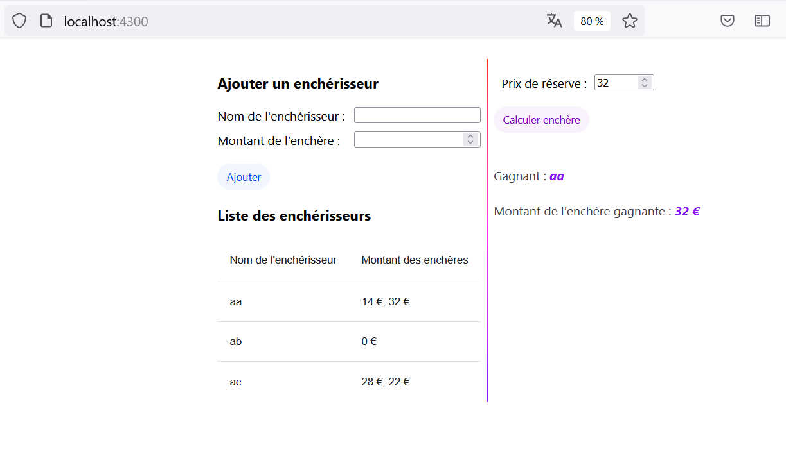

# KataAuction

This project was generated with [Angular CLI](https://github.com/angular/angular-cli) version 17.1.0.

You can find more details on what has been done in the file [WHAT'S DONE](./WHATS_DONE.md).

You can find the user Manuel below.

## Development server

Run `ng serve` for a dev server. Navigate to `http://localhost:4200/`. The application will automatically reload if you change any of the source files.

## Running unit tests

Run `ng test` to execute the unit tests via Jest

## User Manual

Once the application is launched on `http://localhost:4200/`, you can start testing it by adding new bidders:

- For each new addition, you need to provide their name and the bid amount.
- Once the new bidder's data is entered, click the "Add" button.

**NB: You can add multiple bidders and even add multiple bid amounts for the same bidder.**

- Once the list of bidders is completed, you must provide a reserve price (it must be > 0).

- When the reserve price is provided, click on "Calculate Auction" to determine which bidder has won the auction.

- The name and the winning bid amount will then be displayed on the screen.

You can also run unit tests to verify that the code works and returns the expected result.

**A demo is also available in the repository [DEMO](./src/assets/Kata_Auction_demo.mp4).**
To see a demo video, click the screenshot

